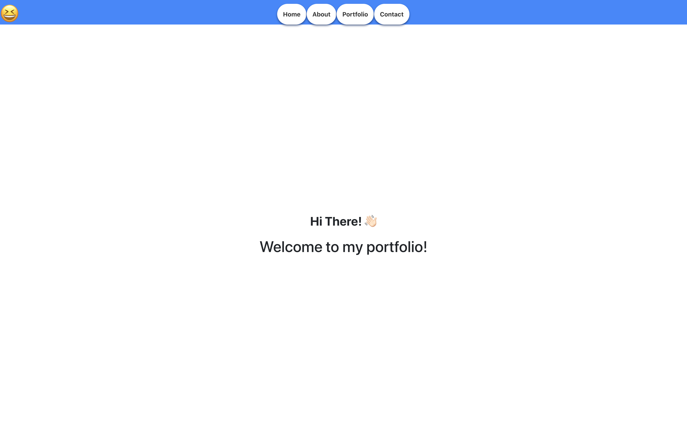

# Note Taker 

## Description 

This is a straightforward yet elegant React application functioning as an expansive portfolio, thoughtfully assembled to showcase a versatile collection of my significant projects. This platform not only encapsulates the simplicity that React is known for but also embodies the diverse range of skills and creativity that I bring to the table.

 

## Table of contents:

* Title
* Description
* Installation
* Usage
* Author
* GitHub Link
* License

###

Written by Christian Alteri

To learn more about my project, [click here](https://github.com/ChristianAlteri/portfolio).

## How to Contribute

Download the source code and add functionality. Request to merge onto Master dev branch

####

